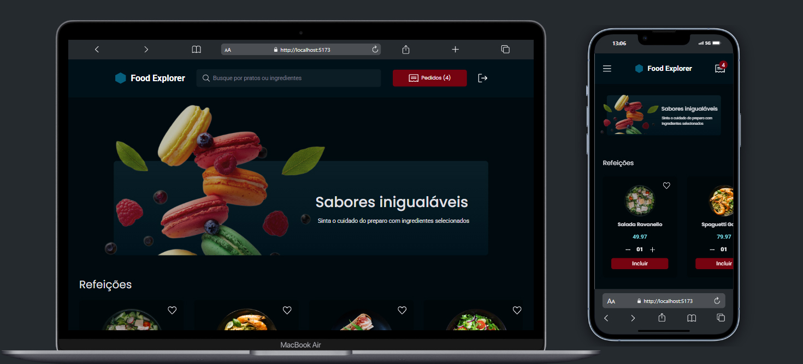

<h1 align="center">Food-Explorer</h1>

> 🍽️ Bem-vindo ao **Food-Explorer**, a interface do sistema de gerenciamento de pedidos para restaurantes! Este projeto contém apenas o frontend, com as telas e o design prontos para integração com um backend funcional.

 
  

## :page_facing_up: Explicação
O **Food-Explorer** é uma plataforma web que simula a interface de um sistema de gerenciamento de pedidos para restaurantes. O projeto foi desenvolvido com **React** para criar interfaces dinâmicas e **TailwindCSS** para garantir um design responsivo e moderno.

O repositório contém apenas o **frontend** do sistema, que inclui as telas para os clientes e administradores de um restaurante. Embora as telas para ambas as funções sejam muito semelhantes, elas possuem algumas diferenças, com funcionalidades específicas baseadas no **role** (administrador ou cliente) do usuário logado. 

## 📁 Seções da página

- **Tela Inicial**: A tela inicial exibe o cardápio do restaurante, com a possibilidade de adicionar produtos ao pedido (sem backend integrado).
- **Pedidos**: Tela para visualizar os itens do pedido, editar ou finalizar a compra (sem persistência de dados).
- **Tela Admin**: O painel do administrador inclui todas as funcionalidades de gerenciamento de pedidos, além de algumas telas e recursos adicionais para administração e controle de status (ainda sem integração com o backend).
- **Tela Client**: A tela para o cliente é similar à do administrador, mas com menos funcionalidades. O cliente pode ver o cardápio e gerenciar seus pedidos, enquanto o administrador tem acesso a mais opções de controle de pedidos e gerenciamento.

### Observação:
- As telas de **admin** e **cliente** são muito semelhantes. A principal diferença está nas funcionalidades disponíveis para cada role. O administrador tem acesso a telas adicionais para gerenciar pedidos, atualizar status e controlar o andamento das transações, enquanto o cliente tem apenas a funcionalidade de visualizar o cardápio e gerenciar seus pedidos.

## 🚀 Tecnologias Utilizadas

### 💻 Interface do Usuário

- **React** → Biblioteca JavaScript para construir interfaces de usuário dinâmicas.
- **TailwindCSS** → Framework CSS utilitário para criar designs modernos e responsivos de forma eficiente.
  - Design modular e flexível.
  - Suporte a componentes reutilizáveis com classes utilitárias.

## 📲 Funcionalidades (Frontend)

### Cliente:
- **Visualização do Cardápio**: Navegação pelo cardápio e adição de itens ao pedido.
- **Gerenciamento de Pedidos**: Exibição e edição dos itens no pedido, com opção de finalizar a compra.
  
### Admin:
- **Gerenciamento de Pedidos**: Acompanhe os pedidos, atualize seu status e gerencie o andamento.
- **Administração de Itens**: Adição e remoção de itens no cardápio (ainda sem backend).
- **Controle de Status**: O administrador pode controlar o status dos pedidos, algo que o cliente não pode fazer.

## 🤝 Colaboradores

Agradecemos às seguintes pessoas que contribuíram para este projeto:

<table>
  <tr>
    <td align="center">
      <a href="#">
         
        
          <b>Diogo Kimisima</b>
        
      </a>
    </td>
  </tr>
</table>

## 📝 Licença

Este projeto está sob licença. Consulte o arquivo <a href="https://github.com/diogokimisima/food-explorer/blob/main/LICENSE">LICENSE</a> para obter mais detalhes.

<a href="#top">Volte para o topo</a>
